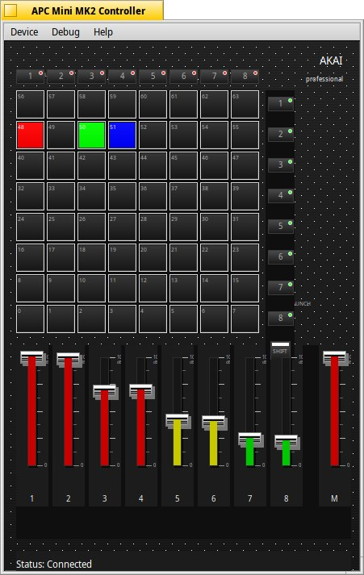

# APC Mini Test Application for Haiku OS

A comprehensive test suite and diagnostic tool for the **Akai APC Mini MIDI controller** on **Haiku OS**. This application provides direct USB Raw access to bypass Haiku's incomplete USB MIDI stack, with graceful fallback to standard MIDI APIs.




## Features

### Core Functionality
- **64-Pad Matrix Testing**: Full 8x8 grid pressure-sensitive pad support
- **9 Fader Control**: 8 channel faders + master fader with CC feedback
- **LED Control**: Complete color support (Green/Red/Yellow + Blink modes)
- **Button Testing**: Track buttons (8), Scene buttons (8), and Shift modifier
- **Performance Metrics**: Real-time latency monitoring and message counting

### Advanced Features
- **USB Raw Access**: Direct USB communication bypassing MIDI stack
- **Dual-Mode Operation**: USB Raw primary, Haiku MIDI fallback
- **Interactive Testing**: Real-time command interface
- **Simulation Mode**: Test without physical hardware
- **Stress Testing**: High-throughput message testing (>1000 msg/sec)
- **Latency Analysis**: Round-trip timing measurement

## Requirements

### System Requirements
- **Haiku OS**: R1/beta5 or later
- **Architecture**: x86_64 (primary), x86_gcc2 (legacy support)
- **Development Tools**: GCC with C++17 support
- **Libraries**: Be API, MIDI API, USB Raw access

### Hardware Requirements
- **Akai APC Mini**: USB MIDI controller (VID: 0x09E8, PID: 0x0028)
- **USB Port**: Direct USB connection required
- **Permissions**: USB raw device access permissions

## Quick Start

### 1. Clone and Build
```bash
git clone https://github.com/atomozero/AkaiAPCmini.git
cd AkaiAPCmini/build

# Build debug version
make debug

# Or build release version
make release

# Optional: Build benchmarks (separate project)
cd ../benchmarks
make
```

### 2. Connect Hardware
```bash
# Connect APC Mini via USB
# Check device detection
make detect-usb
make detect-midi
```

### 3. Run Application
```bash
# Interactive mode (recommended for first use)
./apc_mini_test_debug

# Simulation mode (no hardware required)
./apc_mini_test_debug --simulation

# Stress test mode
./apc_mini_test_debug --stress
```

## Documentation

### User Documentation
- **[User Guide](docs/README.md)**: Comprehensive usage guide
- **[Installation](docs/INSTALL.md)**: Setup and installation instructions
- **[Troubleshooting](docs/TROUBLESHOOTING.md)**: Common issues and solutions

### Technical Documentation
- **[MIDI Kit 2 Architecture](docs/technical/MIDIKIT2_ARCHITECTURE.md)**: Client-server architecture analysis
- **[Thread Safety](docs/technical/THREAD_SAFETY.md)**: USB reader thread synchronization
- **[USB Synchronization](docs/technical/USB_SYNCHRONIZATION.md)**: Atomic operations implementation
- **[Fader Mapping Fix](docs/technical/FADER_MAPPING_FIX.md)**: CC mapping correction details
- **[Driver Testing](docs/technical/DRIVER_TESTING.md)**: MidiKit driver testing methodology

### Performance Benchmarks
- **[Benchmark Suite](benchmarks/README.md)**: Independent MIDI performance testing project
- **[Results & Analysis](benchmarks/RESULTS.md)**: Haiku MIDI stack performance analysis

## Interactive Commands

| Key | Function | Description |
|-----|----------|-------------|
| `h` | Help | Show command help |
| `s` | Statistics | Display performance stats |
| `t` | Test Pads | Test all 64 pads sequentially |
| `f` | Test Faders | Monitor fader movements |
| `b` | Test Buttons | Monitor button presses |
| `c` | Test Colors | Cycle through LED colors |
| `r` | Reset | Reset device and clear stats |
| `q` | Quit | Exit application |

## Development

### Building from Source
```bash
cd build

# Debug build with symbols
make debug

# Release build optimized
make release

# Build examples
make examples

# Run tests
make test

# Clean build artifacts
make clean
```

### Testing
```bash
# Run all tests
./scripts/test_runner.sh

# Specific test suites
./scripts/test_runner.sh unit
./scripts/test_runner.sh integration
./scripts/test_runner.sh stress

# Performance benchmarks (separate project)
cd benchmarks
make run-all
```

### Code Quality
```bash
# Format code
make format

# Static analysis
make lint
```

## Architecture

### Dual-Access Design
The application uses a **primary USB Raw + fallback MIDI** architecture:
1. **USB Raw Access**: Direct USB communication bypassing MIDI stack (preferred)
2. **Haiku MIDI API**: Standard MIDI interface fallback when USB Raw fails
3. **Graceful Degradation**: Automatic fallback with feature preservation

### Threading Model
- **Main Thread**: User interface and application logic
- **USB Reader Thread**: Continuous USB message polling (when using USB Raw)
- **MIDI Thread**: Haiku MIDI message handling (when using MIDI fallback)

## MIDI Mapping

### Pad Matrix (8x8 = 64 pads)
- **Coordinates**: (x,y) where x=0-7, y=0-7
- **MIDI Notes**: 0x00-0x3F (0-63)
- **Formula**: `note = y * 8 + x`

### Controls
- **Faders**: CC 48-56 (8 track faders + 1 master)
- **Track Buttons**: Notes 100-107
- **Scene Buttons**: Notes 112-119
- **Shift Button**: Note 122

### LED Colors
- `0x00`: Off
- `0x01`: Green / `0x02`: Green Blink
- `0x03`: Red / `0x04`: Red Blink
- `0x05`: Yellow / `0x06`: Yellow Blink

## Contributing

Contributions are welcome! This project participates in **Hacktoberfest 2025** - contributions made in October count towards Hacktoberfest!

### How to Contribute

1. Fork the repository
2. Create a feature branch (`git checkout -b feature/amazing-feature`)
3. Commit your changes (`git commit -m 'Add amazing feature'`)
4. Push to the branch (`git push origin feature/amazing-feature`)
5. Open a Pull Request

### Contribution Ideas
- Improve USB device detection and error handling
- Add support for other MIDI controllers
- Enhance GUI with additional visualizations
- Improve documentation and examples
- Add unit tests and integration tests
- Optimize performance and reduce latency
- Port to other BeOS-compatible systems

### Guidelines
- Follow existing code style (C++17, Allman braces, 4-space indents)
- Test on real hardware when possible
- Update documentation for new features
- Maintain Haiku R1/beta5+ compatibility

## License

This project is licensed under the MIT License - see the [LICENSE](LICENSE) file for details.

## Support

### Resources
- **Haiku Documentation**: https://www.haiku-os.org/docs/
- **APC Mini Manual**: Akai Professional documentation
- **MIDI Specification**: https://midi.org/specifications

### Reporting Issues
When reporting issues, please include:
1. Haiku version and revision
2. Hardware information (APC Mini model/firmware)
3. Debug output and error messages
4. Test results with both USB Raw and MIDI fallback modes

## Acknowledgments

- Haiku OS development team for the excellent BeOS-inspired operating system
- Akai Professional for the APC Mini hardware
- Contributors to the MIDI specification

---

**APC Mini Test Application v1.0.0**
*Comprehensive MIDI controller testing for Haiku OS*
